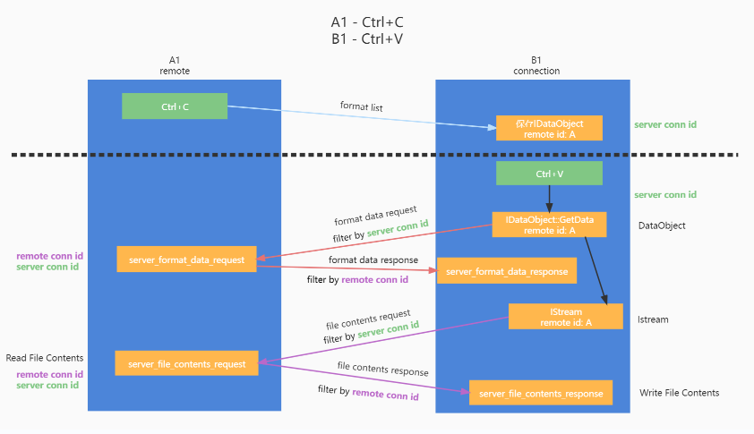

# clipboard

Copy files and text through network.
Main lowlevel logic from [FreeRDP](https://github.com/FreeRDP/FreeRDP).

To enjoy file copy and paste feature on Linux/OSX,
please build with `unix-file-copy-paste` feature.

TODO: Move this lib to a separate project.

## How it works

Terminalogies:

- cliprdr: this module
- local: the endpoint which initiates a file copy events
- remote: the endpoint which paste the file copied from `local`

The main algorithm of copying and pasting files is from
[Remote Desktop Protocol: Clipboard Virtual Channel Extension](https://winprotocoldoc.blob.core.windows.net/productionwindowsarchives/MS-RDPECLIP/%5bMS-RDPECLIP%5d.pdf),
and could be concluded as:

0. local and remote notify each other that it's ready.
1. local subscribes/listening to the system's clipboard for file copy
2. local once got file copy event, notice the remote
3. remote confirms receive and try pulls the file list
4. local updates its file-list, the remote flushes pulled file list to the clipboard
5. remote OS or desktop manager initiates a paste, making other programs reading
   clipboard files. Convert those reading requests to RPCs

   - on Windows, all file reading will go through the stream file API
   - on Linux/OSX, FUSE is used for converting reading requests to RPCs
     - in case of local clipboard been transferred back
       and leading to a dead loop,
       all file copy event pointing at the FUSE directory will be ignored

6. finishing pasting all files one by one.

In a perspective of network data transferring:

```mermaid
sequenceDiagram
    participant l as Local
    participant r as Remote
    note over l, r: Initialize
    l ->> r: Monitor Ready
    r ->> l: Monitor Ready
    loop Get clipboard update
        l ->> r: Format List (I got update)
        r ->> l: Format List Response (notified)
        r ->> l: Format Data Request (requests file list)
        activate l
            note left of l: Retrive file list from system clipboard
            l ->> r: Format Data Response (containing file list)
        deactivate l
        note over r: Update system clipboard with received file list
    end
    loop Some application requests copied files
        note right of r: application reads file from x to x+y
        note over r: the file is the a-th file on list
        r ->> l: File Contents Request (read file a offset x size y)
        activate l
            note left of l: Find a-th file on list, read from x to x+y
            l ->> r: File Contents Response (contents of file a offset x size y)
        deactivate l
    end
```

Note: In actual implementation, both sides could play send clipboard update
and request file contents.
There is no such limitation that only local can update clipboard
and copy files to remote.

## impl

### windows





The protocol was originally designed as an extension of the Windows RDP,
so the specific message packages fits windows well.

When starting cliprdr, a thread is spawn to create a invisible window
and to subscribe to OLE clipboard events.
The window's callback (see `cliprdr_proc` in `src/windows/wf_cliprdr.c`) was
set to handle a variaty of events.

Detailed implementation is shown in pictures above.

### Linux/OSX

The Cliprdr Server implementation has mainly 3 parts:

- Clipboard Client
- Local File list
- FUSE server

#### Clipboard Client

The clipboard client has a thread polling for file urls on clipboard.

If the client found any updates of file urls,
after filtering out those pointing to our FUSE directory or duplicated,
send format list directly to remote.

The cliprdr server also uses clipboard client for setting clipboard,
or retrive paths from system.

#### Local File List

The local file list is a temperary list of file metadata.
When receiving file contents PDU from peer, the server picks
out the file requested and open it for reading if necessary.

Also when receiving Format Data Request PDU from remote asking for file list,
the local file list should be rebuilt from file list retrieved from Clipboard Client.

Some caching and preloading could done on it since applications are likely to read
on the list sequentially.

#### FUSE server

The FUSE server could convert POSIX file reading request to File Contents
Request/Response RPCs.

When received file list from remote,
the FUSE server will figure out the file system tree and rearrange its content.

#### Groceries

- The protocol was originally implemented for windows,
  so paths in PDU will all be converted to DOS formats in UTF-16 LE encoding,
  and datetimes will be converted to LDAP timestamp instead of
  unix timestamp

  ```text
  UNIX
  /usr/bin/rustdesk
  ->
  DOS
  \usr\bin\sashrdesk
  ```

- To better fit for preserving permissions on unix-like platforms,
  a reserved area of FileDescriptor PDU

- you may notice
  the mountpoint is still occupied after the application quits.
  That's because the FUSE server was not mounted with `AUTO_UNMOUNT`.
  - It's hard to implement gressful shutdown for a multi-processed program
  - `AUTO_UNMOUNT` was not enabled by default and requires enable
    `user_allow_other` in configure. Letting users edit such global
    configuration to use this feature might not be a good idea.
  - use [`umount()`](https://man7.org/linux/man-pages/man2/umount.2.html)
    syscall to unmount will also require that option.
  - we currently directly call [`umount`](https://man7.org/linux/man-pages/man8/umount.8.html)
    program to unmount dangling FUSE server. It worked perfectly for now.
